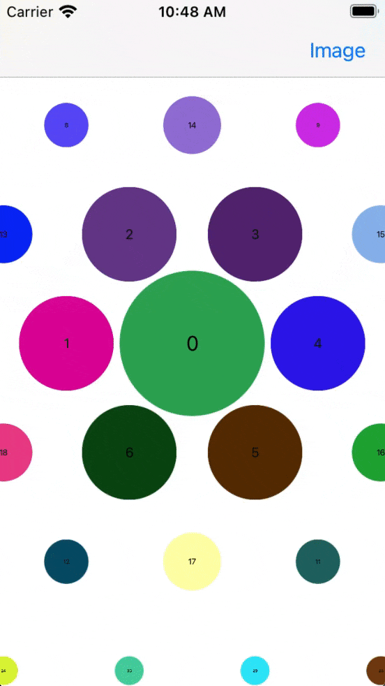
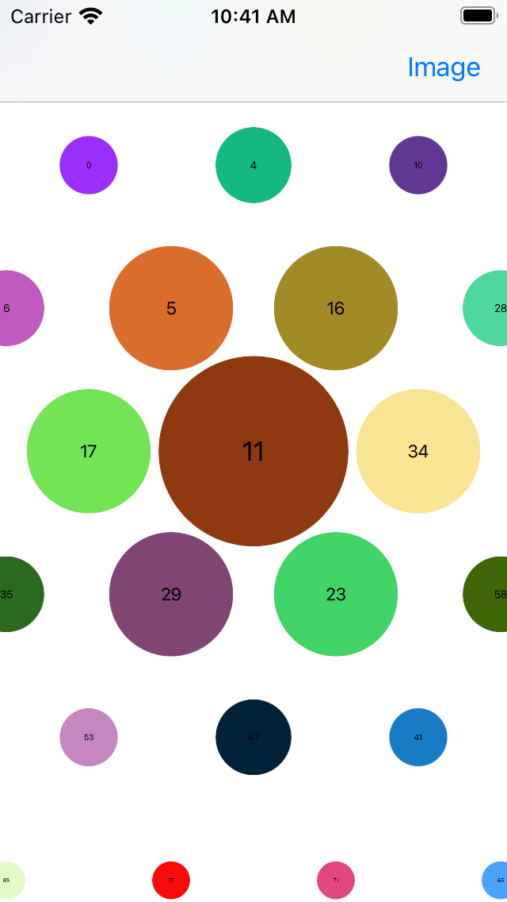

# WatchLayout

[](https://cocoapods.org/pods/WatchLayout)
[](https://cocoapods.org/pods/WatchLayout)
[](https://cocoapods.org/pods/WatchLayout)

## Requirements

iOS 11+

## Installation

### Cocoapods
WatchLayout is available through [CocoaPods](https://cocoapods.org). To install
it, simply add the following line to your Podfile:

```ruby
pod 'WatchLayout'
```

### Swift Package Manager

```swift
dependencies: [
    .package(url: "https://github.com/HocTran/WatchLayout.git", .upToNextMajor(from: "1.0.2"))
]
```

## Usage

```swift
let layout = WatchLayout()
```

**Support configurations**

Set the item size for collection view cell.
```swift
layout.itemSize = 200
```

Set the cell item spacing. Minus means the items can be overlapped. Default value 0.
```swift
layout.spacing = -40
```

Set the scaling for item next to the item in the center. Default value 0.4
```swift
layout.nextItemScale = 0.4
```

Set the minimum scaling for item depending on the distance to the center.  Default value 0.2
```swift
layout.minScale = 0.2
```

Assign the custom layout to UICollectionView
```swift
collectionView.collectionViewLayout = layout
```

Scroll to an item at the index path
```swift
    self.collectionView.setContentOffset(layout.centeredOffsetForItem(indexPath: IndexPath(item: 0, section: 0)), animated: true)
```

Get the current centred index
```swift
    layout.centeredIndexPath
```

## Screenshots

Positioning | Scrolling
:-------------:|:-------------:
  |  


Example 01 | Example 02
:-------------:|:-------------:
  |  

## Example

To run the example project, clone the repo, open `WatchLayout.xcworkspace`.

Select scheme `WatchLayout`, **Cmd+B** to build the framwork.

Select scheme `Example-iOS`, and run the example.

## Author

HocTran, tranhoc78@gmail.com

## License

WatchLayout is available under the MIT license. See the [LICENSE file](LICENSE) for more info.
